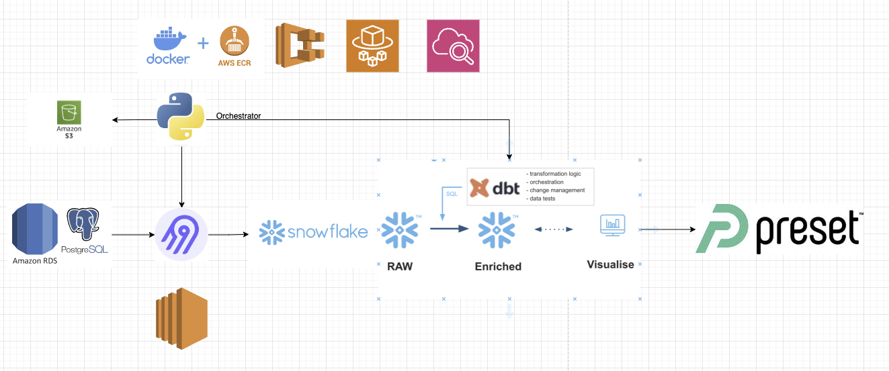
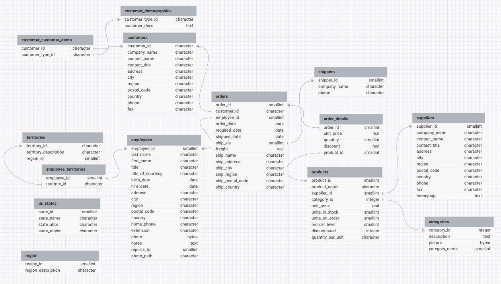
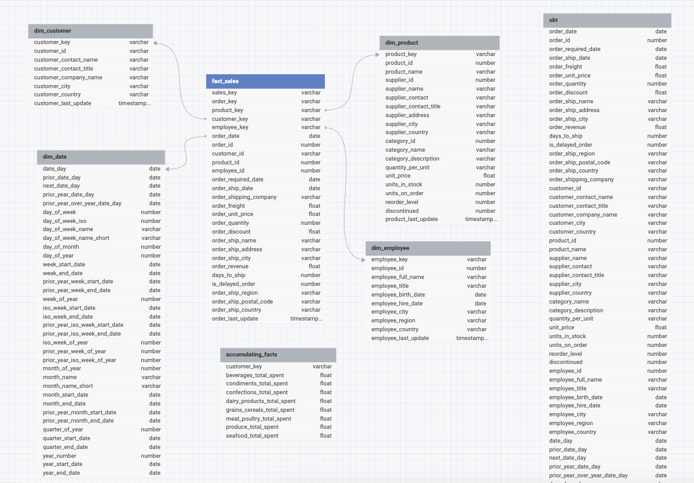
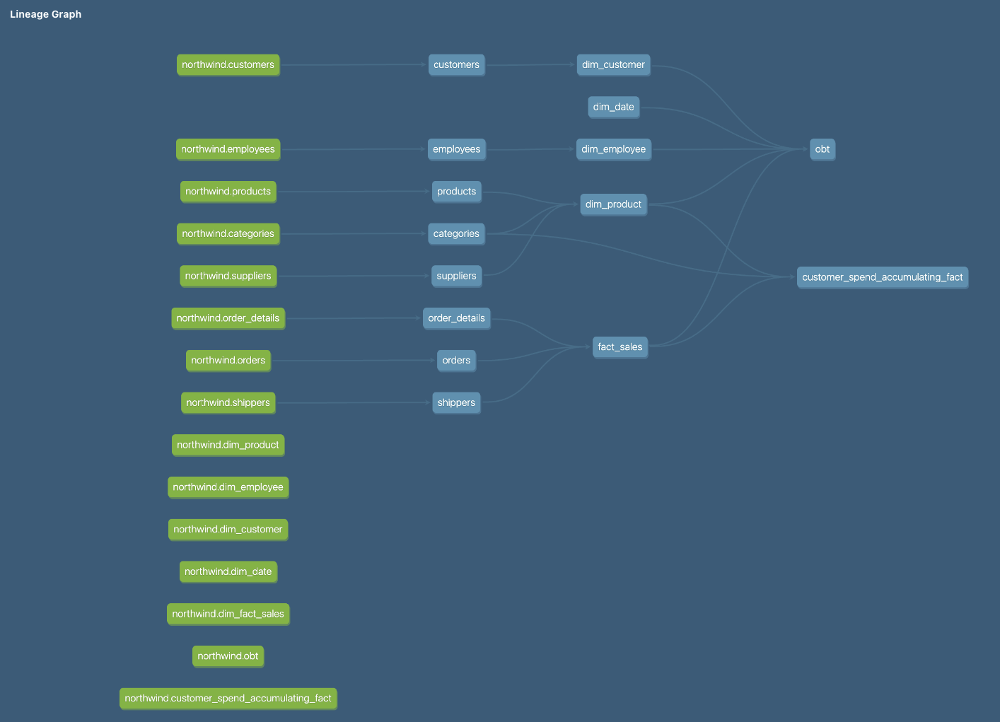
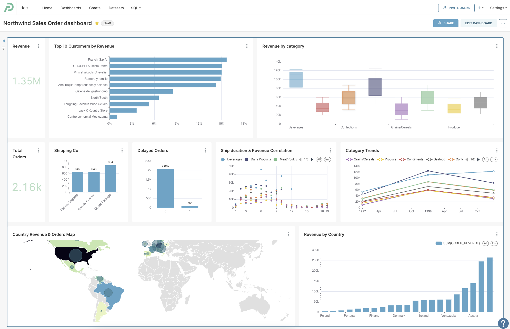

# Northwind Store ELT Project

## Overview

By analyzing the data from the Northwind store database, we aim to gain business insights. Specifically, we will be able to determine the most sold product category, identify the customers who made the most purchases, and analyze the total number of orders along with the impacts of any delays. Additionally, we will evaluate the revenue generated by different regions and countries, allowing us to understand which areas are most profitable. This comprehensive analysis will provide a detailed understanding of sales performance and customer behavior, helping to inform strategic business decisions.

## Project Components

### 1. Source Database: Northwind Database (OLTP)

The Northwind database is the source OLTP system running on PostgreSQL.  This database includes tables such as Customers, Orders, Products, Suppliers, and Categories, providing comprehensive data for analysis.

The Northwind database comes pre-populated with sample data, allowing for immediate exploration and analysis without the need for extensive data entry. It serves as an ideal dataset for educational and training purposes, offering a realistic scenario for practicing SQL queries, data analysis, and database management techniques.

### 2. Destination Data Warehouse: Snowflake (OLAP)

Snowflake is the destination data warehouse where the extracted data from the Northwind database will be loaded for analytical processing.

### 3. Data Extraction and Load Tool: Airbyte

Airbyte is the data extraction and load tool used in this project. An Airbyte connector has been configured to extract data from the source database and load into the 'Raw Schema' in Snowflake.  Airbyte will also create an 'airbyte_internal' schema in the same Snowflake database.

### 4. Data Transformation Tool: dbt

DBT (Data Build Tool) as the data transformation tool, reads the data loaded to the 'raw' schema in Snowflake and will perform data transformations, testing and creates the final target tables within Snoflake. The target schemas include 'staging' as the first schema populated replicating like for like the tables as presented in the 'raw' schema.  Then the DBT transformations are performed to create the dimensional model in the schema 'marts'. 

### 5. Orchestrator: orchestrate.sh bash file

The orchestrate.sh script orchestrates the end-to-end data processing workflow. This ensures that the data pipeline is executed in the correct order and that all steps are completed successfully, resulting in transformed data ready for analysis.

Order of execution: 
- Run a Python script to extract and load data using Airbyte.
- Navigates to the DBT project directory.
- Installs DBT dependencies.
- Builds and transforms the data using DBT.

### 6. BI Tool: Preset

Create interactive and insightful dashboards using Preset, which is a powerful data visualization tool built on Apache Superset. This step involves creating a semantic layer to read from the marts table, specifically the One Big Table (OBT) in the marts schema, and then using this layer to build the necessary visualizations for data analysis.

## ELT Project Workflow 

### 1. Extraction

Airbyte connects to the PostgreSQL database and leverages the enabled Change Data Capture (CDC) functionality to extract data incrementally as source records are changed. CDC ensures efficiency as only the changed or updated data since the last extraction is captured.

### 2. Loading

Airbyte loads the extracted data into Snowflake into the 'raw' schema.

### 3. Transformation & testing

Within DBT, data modeling techniques are used to transform the data aligned to the affformentioned business use-cases. And this process creates the staging and mart tables.  Data transformation and enrichment techniques tasks are performed on Snowflake. Lastly, testing steps are defined to be performed as part of every run to garantee data quality.  

## Implementation Steps

### 1. Set up Source Database

- Create a PostgreSQL database in AWS RDS.
- Connect to the database using a management tool for PostgreSQL and restore the Northwind database usin the psql script. https://github.com/pthom/northwind_psql

### 2. Deploy Airbyte on AWS EC2 with SSH Tunneling

- Launch an EC2 instance on AWS and connect to it via SSH.
- Install Docker and Docker Compose on the EC2 instance.
- Clone the Airbyte repository and start the Docker containers.
- Access Airbyte securely via SSH tunneling.

### 3. Set up Airbyte

- Configure Sources and Destinations.  The source will be the RDS postgres database, and will be configured to use Read Changes using Write-Ahead Log (CDC).
- The target destination Snowflake will be configured to create the 'raw' schema.  To capture the replicated data from the source

### 4. Exexuting Airbyte API from python

- Create a Python script to programmatically control Airbyte through its API. For more reference, go to [Airbyte API](https://api.airbyte.com/) to see how the API works.
- In this project, the `src/main.py` Python file hosts the code responsible for triggering the PostgreSQL - Snowflake connection sync.
- In order to run the `src/main.py` Python file, please provide the following environment variables:
    - AIRBYTE_USERNAME
    - AIRBYTE_PASSWORD
    - AIRBYTE_SERVER_NAME
    - AIRBYTE_CONNECTION_ID
    - SNOWFLAKE_USERNAME
    - SNOWFLAKE_PASSWORD

### 5. Transform the Data

- To transform the data, ensure all necessary dbt packages, including the Snowflake plugin, are listed in the requirements.txt file for automatic installation during the Docker image build process. 
- Initialize a new dbt project using dbt init in the CLI, which sets up the directory structure and configuration files. 
- Name your project `warehouse`  to create a dedicated folder, and use the models folder within this directory to define your data transformations. 
- Each folder within the models directory represents a schema, with each file corresponding to a table model. 
- Use dbt's Snowflake SQL syntax to define the transformations for each model, ensuring a structured approach to data modeling.

### 6. Orchestrate Workflow

- Create a bash file to run the workflow and call each step in the correct order.
- In this project, the `orchestrate.sh` file is responsible for orchestrating the tasks: first it calls the Airbyte API, installs the dbt packages, and then performs the transformations materializing the dbt models.

### 7. Schedule ELT pipeline on the cloud

To ensure the ELT pipeline runs efficiently and automatically in the cloud:

- Containerize the Project with Docker: Package the project code and all its dependencies using Docker. This involves creating a Dockerfile that specifies the environment and dependencies required to run the project. The Dockerfile will build an image containing everything needed to execute the ELT pipeline.

- Push the Docker Image to AWS ECR: Once the Docker image is built, push it to Amazon Elastic Container Registry (ECR), which is a managed Docker container registry that makes it easy to store, manage, and deploy Docker container images.

- Schedule the Docker Container in AWS ECS: Set up a scheduled task in Amazon Elastic Container Service (ECS) to run the Docker container. ECS will pull the Docker image from AWS ECR and execute it according to the defined schedule. This ensures that the ELT pipeline runs automatically at specified intervals, maintaining up-to-date and processed data.

### 8. Create interactive and insightful dashboards using Preset

The final step in our data pipeline is to create interactive and insightful dashboards using Preset, which is a powerful data visualization tool built on Apache Superset. This step involves creating a semantic layer to read from the marts table, specifically the One Big Table (OBT) in the marts schema, and then using this layer to build the necessary visualizations for data analysis.

    - Build visualizations to answer key business questions, such as:
    - Which product category was the most sold?
    - Which customers made the most purchases?
    - How many orders were made and what were the impacts of any delays?
    - Which regions and countries generated the most revenue?
    - Combine these visualizations into a cohesive dashboard that provides a comprehensive view of the business metrics.

Once the dashboard is complete, you can share it with team members by providing access through Preset.
Enable collaborative features such as comments and annotations to facilitate data-driven discussions and decision-making.

https://6395dfe8.us2a.app.preset.io/superset/dashboard/9/?native_filters_key=Yy9x0K83msLcVvhUNpjVyPhjWcXA7MoNR5jSWZs2DlzPP86ClnuevChlsIk8elh5

## Conclusion

By following these steps, you will have a comprehensive data integration and transformation pipeline using Airbyte, dbt, Snowflake, and Preset. This setup will allow you to manage your data pipeline efficiently, ensure data quality, and create meaningful visualizations for data analysis.
